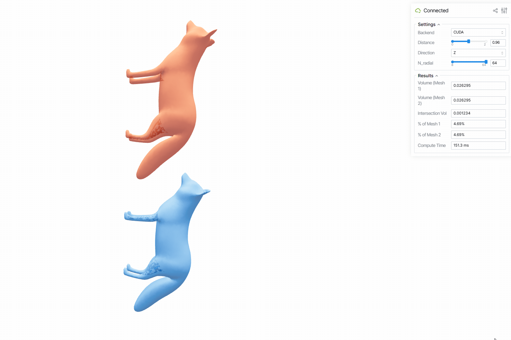
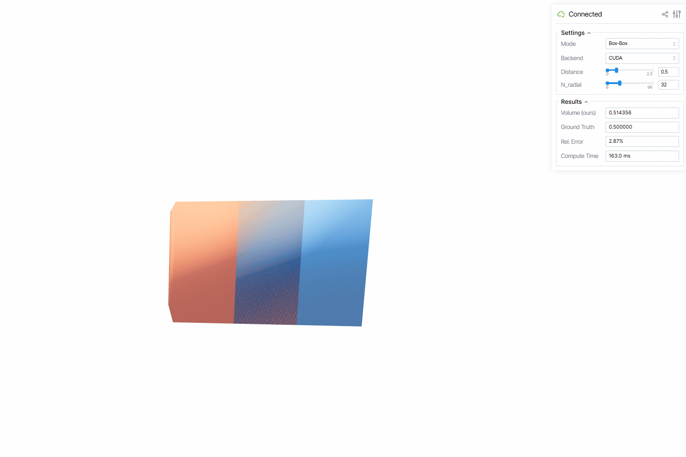

# Fast Intersection Volumes

This repo explores how to compute **intersection volumes between 3D solids** using a **boundary-only formulation** and evaluates it numerically with a **Fourier (k-space) method**.

The pipeline is:

1. Express the intersection volume of two solids as a **double surface integral** over their boundaries.  
2. Rewrite the $1/\|x-y\|$ kernel via its **Fourier representation**.  
3. Discretise k-space (Gauss–Legendre × Lebedev) and precompute per-object Fourier data.  
4. Recover all pairwise overlap volumes from a single matrix product $J^\top D J$.

---

## 1. Mathematical background
### 1.1 Double surface integral for intersection volume

For two solids $\Omega_1,\Omega_2$, the intersection volume is

$$
\text{Vol}(\Omega_1 \cap \Omega_2)
  = \int_{\mathbb{R}^3}
      \chi_{\Omega_1}(p)\,\chi_{\Omega_2}(p)\, dp.
$$

Plugging the double-layer representation of $\chi_{\Omega_2}$ into the integral and using the divergence theorem on $\Omega_1$ converts the volume integral into a **double surface integral** over the two boundaries:

$$
\text{Vol}(\Omega_1 \cap \Omega_2)
  = \frac{1}{4\pi}
    \int_{\partial\Omega_1}
    \int_{\partial\Omega_2}
      \frac{n_1(x)\cdot n_2(y)}{\|x - y\|}\,
    dS_x\, dS_y.
$$

This is the main continuous formula behind the project: overlap is a **Coulomb-type interaction energy** between two surfaces, with kernel $1/\|x-y\|$ and a normal–normal dot product.

This structure is closely related to:

- **Generalized winding numbers** and solid angles in computer graphics,  
- **Double-layer potentials** / boundary integral methods in potential theory,  
- **View-factor integrals** in radiative heat transfer, which also integrate normal products over $1/\|x-y\|^2$.

---

## 2. Fourier formulation (main numerical method)

The project does **not** evaluate the double surface integral directly. Instead it uses a **Fourier representation** of the Newtonian kernel:

$$
\frac{1}{\|x-y\|}
  = \frac{1}{(2\pi)^3}
    \int_{\mathbb{R}^3}
      \frac{e^{i k\cdot(x-y)}}{\|k\|^2}\, dk.
$$

Inserting this into the surface–surface formula and rearranging integrals yields a k-space expression

$$
\text{Vol}(\Omega_1 \cap \Omega_2)
  = C
    \int_{\mathbb{R}^3}
      \frac{A_1(k)\, A_2(-k)}
           {\|k\|^2}\, dk,
$$

where for each object $\Omega_n$

$$
A_n(k)
  = \int_{\partial\Omega_n} e^{ik\cdot x}\, n(x)\, dS_x
  = i k\, F_n(k),
$$

and

$$
F_n(k)
  = \int_{\Omega_n} e^{ik\cdot x}\, dx
$$

is the Fourier transform of the indicator function $\chi_{\Omega_n}$. In words:

> Each solid is summarized by a **form-factor field** $F_n(k)$ in Fourier space; overlap is an inner product of these fields with weight $1/\|k\|^2$.

This is the main numerical object the code computes.

---

## 3. Discretising k-space

We parameterize frequencies in spherical coordinates

$$
k = (k_x,k_y,k_z),
\quad
k_x = r\sin\theta\cos\phi,\;
k_y = r\sin\theta\sin\phi,\;
k_z = r\cos\theta.
$$

The integral over $k$ is discretised by a tensor-product quadrature:

- **Radial part** $r$:
  - Gauss–Legendre nodes $t_\ell$ mapped to $[0,\infty)$,
  - $\ell = 1,\dots,L$ with $L \in \{16,32,64,96,128\}$.
- **Angular part** $(\theta_j,\phi_j)$:
  - Lebedev spherical quadrature with $M \approx 10^2\!-\!10^4$ nodes.

Total number of k-nodes is $N_k = L \times M \approx 10^3\!-\!10^6$.

The integral turns into a sum

$$
\text{Vol}(\Omega_1 \cap \Omega_2)
  \approx
    \sum_{q=1}^{N_k}
      w_q\,
      \frac{A_1(k_q)\, A_2(-k_q)}{\|k_q\|^2},
$$

where $w_q$ already includes Jacobian and quadrature weights.

---
## 4. Analytic test shapes

To debug and validate the k-space discretisation, the repo includes shapes with known closed-form Fourier transforms.

### 4.1 Axis-aligned cube $[-1/2,1/2]^3$

$$
F_{\text{cube}}(k)
  = \prod_{i=x,y,z}
      \frac{\sin(k_i/2)}{k_i/2},
$$

so $F_{\text{cube}}(0) = 1$ (unit volume).

### 4.2 Unit ball

$$
F_{\text{ball}}(k)
  = 4\pi
    \frac{
      \sin\|k\|
      - \|k\|\cos\|k\|
    }{\|k\|^3}.
$$

We compare numerical quadrature against these analytic formulas to check convergence vs. $L,M$.

---

## 5. Moments from $F(k)$

A Taylor expansion of $F_n(k)$ around $k=0$

$$
F_n(k)
  = F_n(0)
    + k\cdot \nabla F_n(0)
    + \tfrac12 k^\top \nabla^2 F_n(0)\, k + \dots
$$

encodes geometric quantities of $\Omega_n$:

- $F_n(0) = \text{Vol}(\Omega_n)$,
- $\nabla F_n(0)$ gives the **barycentre**,
- $\nabla^2 F_n(0)$ contains **second moments / inertia tensor**.

So once we have the Fourier data, we can also recover basic shape descriptors “for free”.

---

## 6. Applications

### 6.1 Collision / contact detection via intersection volume

The core quantity this repo computes is the **intersection volume**

$$
\mathrm{Vol}(\Omega_i \cap \Omega_j).
$$

For a collection of solids, the matrix

$$
V_{ij} \approx \mathrm{Vol}(\Omega_i \cap \Omega_j)
$$

from the $J^\top D J$ product can be used as a **pairwise collision / contact table**:

- **Broad phase**: treat any pair with $V_{ij} > 0$ (or above a small threshold) as colliding.  
- **Narrow phase / contact strength**: the magnitude of $V_{ij}$ can serve as a simple **penetration / overlap measure**, which could be mapped to penalty forces or used to prioritize more accurate local queries.

Because the computation is cast as a matrix multiplication on shared k-nodes, you get all pairwise overlaps in one GPU-friendly operation instead of checking each pair independently.

### 6.2 Shape similarity from normalized overlap

Once we can evaluate intersection volumes, we get a simple **shape similarity score** for free. For two solids $\Omega_1$ and $\Omega_2$, define

$S(\Omega_1, \Omega_2) = \dfrac{\mathrm{Vol}(\Omega_1 \cap \Omega_2)}{\sqrt{\mathrm{Vol}(\Omega_1)\,\mathrm{Vol}(\Omega_2)}}.$

Basic properties:

- $0 \le S(\Omega_1,\Omega_2) \le 1$.  
- $S = 1$ if the shapes coincide almost everywhere.  
- $S = 0$ if they are disjoint.  
- If both shapes are scaled by the same global factor, $S$ is unchanged (volumes scale out)

---

## 7. Status and roadmap

Planned / current components:

- [x] Theory note: derivation of double surface integral and literature survey  
- [x] Analytic reference implementations for cube / sphere form factors  
- [x] Mesh-based discretisation of $\partial\Omega$ and numerical evaluation of $F_n(k_q)$  
- [x] GPU implementation of the k-space sampling and $J^\top D J$  
- [ ] Experiments on:
  - shape similarity based on overlap volume,
  - clustering / kernels built from $V$,
  - potential applications in contact energies.

---

## 8. License

TBD.

## 9. Demos

  
  &nbsp;&nbsp;&nbsp;&nbsp;
  

